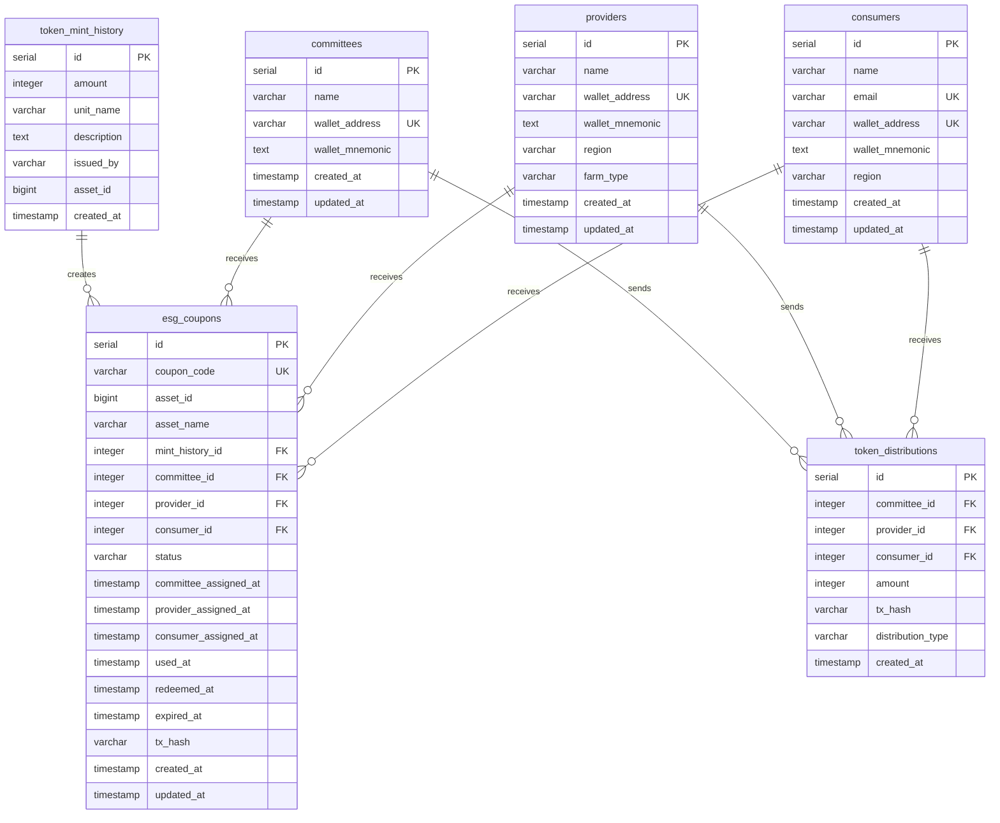
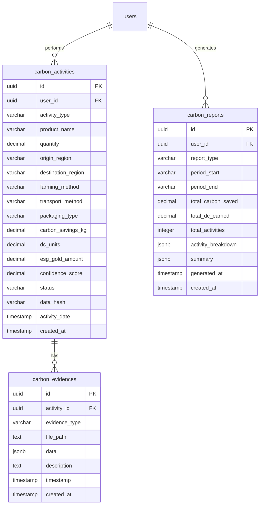
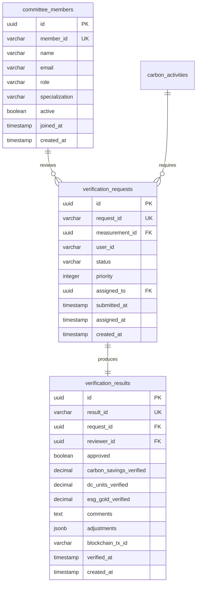
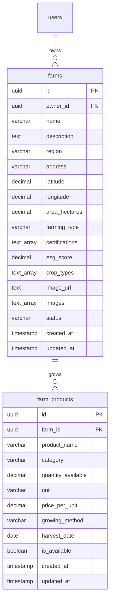
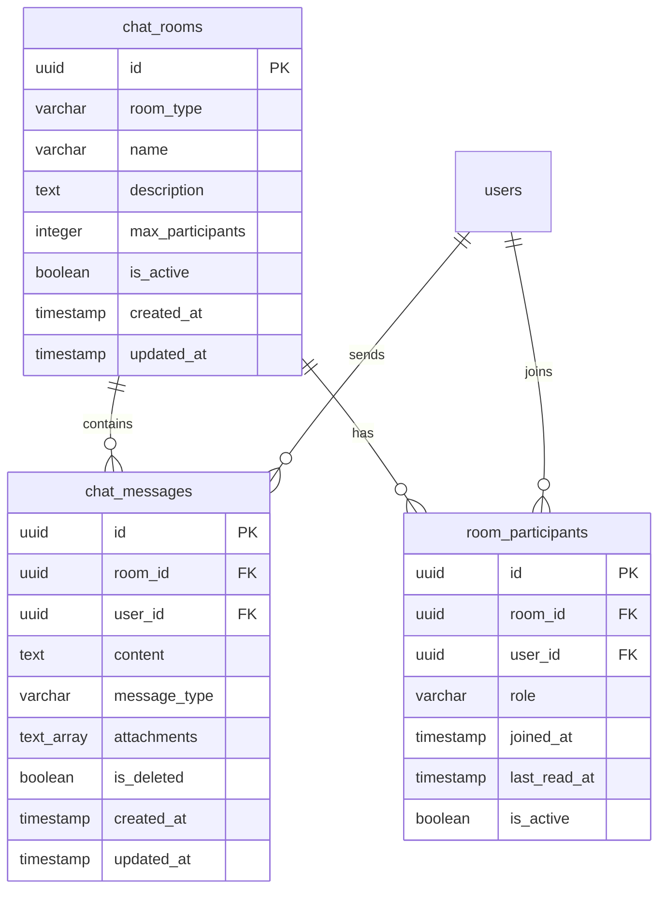
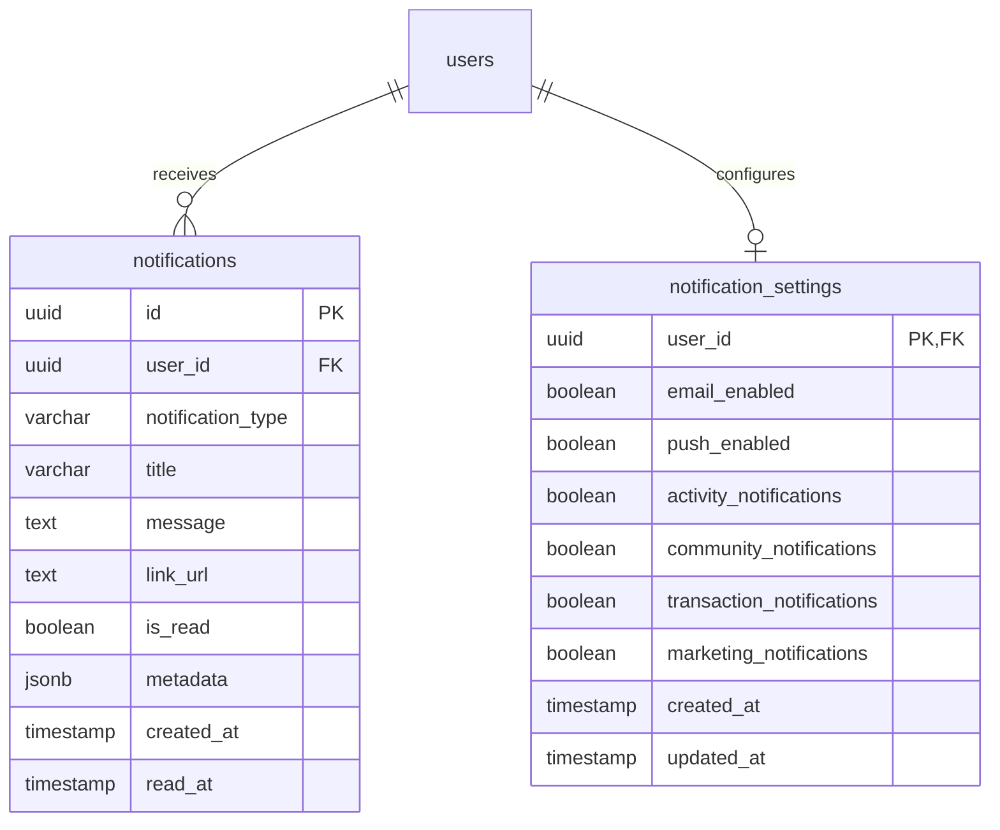

# PAM-TALK 데이터베이스 ERD (Entity Relationship Diagram)

## 전체 ERD - Core Tables

```mermaid
erDiagram
    %% ========== USER & PROFILE ==========
    users ||--o| profiles : has
    users ||--o| wallets : has
    users ||--o{ esg_activities : performs
    users ||--o{ token_transactions : sends
    users ||--o{ token_transactions : receives
    users ||--o{ products : sells
    users ||--o{ orders : places
    users ||--o{ reviews : writes
    users ||--o{ posts : creates
    users ||--o{ comments : writes

    users {
        uuid id PK
        varchar email UK
        varchar name
        varchar phone
        varchar role
        varchar algorand_address
        timestamp created_at
        timestamp updated_at
        timestamp last_login
        boolean is_active
        text avatar_url
    }

    profiles {
        uuid user_id PK,FK
        text bio
        varchar location
        date birth_date
        varchar gender
        varchar occupation
        text_array interests
        integer esg_score
        decimal carbon_saved
        integer total_activities
        timestamp created_at
        timestamp updated_at
    }

    %% ========== WALLET & TRANSACTIONS ==========
    wallets ||--o{ token_transactions : from
    wallets ||--o{ token_transactions : to

    wallets {
        uuid user_id PK,FK
        varchar algorand_address UK
        decimal dc_balance
        decimal esg_gold_balance
        decimal total_earned
        decimal total_spent
        timestamp created_at
        timestamp updated_at
    }

    token_transactions {
        uuid id PK
        varchar transaction_type
        varchar token_type
        uuid from_user_id FK
        uuid to_user_id FK
        decimal amount
        varchar blockchain_tx_id
        varchar status
        text reason
        uuid related_activity_id FK
        timestamp created_at
        timestamp confirmed_at
    }

    %% ========== ESG ACTIVITIES ==========
    esg_activity_types ||--o{ esg_activities : categorizes
    esg_activities ||--o{ token_transactions : generates

    esg_activity_types {
        varchar id PK
        varchar name_ko
        varchar name_en
        text description
        varchar icon
        decimal base_reward
        decimal carbon_factor
        boolean verification_required
        boolean is_active
        timestamp created_at
    }

    esg_activities {
        uuid id PK
        uuid user_id FK
        varchar activity_type FK
        varchar title
        text description
        text image_url
        varchar location
        decimal carbon_reduction
        decimal reward_amount
        varchar status
        timestamp submitted_at
        timestamp reviewed_at
        uuid reviewed_by FK
        text review_comment
        varchar blockchain_hash
        jsonb metadata
        timestamp created_at
        timestamp updated_at
    }

    %% ========== MARKETPLACE ==========
    products ||--o{ order_items : contains
    products ||--o{ reviews : receives

    products {
        uuid id PK
        uuid farmer_id FK
        varchar name
        text description
        varchar category
        varchar sub_category
        decimal price_per_kg
        decimal available_quantity
        varchar unit
        text image_url
        text_array images
        text_array certifications
        decimal carbon_footprint
        varchar location
        integer distance_km
        decimal rating
        integer review_count
        integer likes
        varchar status
        varchar badge
        integer discount_rate
        timestamp created_at
        timestamp updated_at
    }

    orders ||--o{ order_items : contains
    orders ||--o| reviews : may_have

    orders {
        uuid id PK
        uuid user_id FK
        varchar order_number UK
        varchar status
        decimal total_amount
        decimal discount_amount
        decimal final_amount
        varchar payment_method
        varchar payment_status
        varchar blockchain_tx_id
        text delivery_address
        varchar delivery_phone
        text delivery_note
        timestamp ordered_at
        timestamp confirmed_at
        timestamp shipped_at
        timestamp delivered_at
        timestamp cancelled_at
        text cancellation_reason
        timestamp created_at
        timestamp updated_at
    }

    order_items {
        uuid id PK
        uuid order_id FK
        uuid product_id FK
        decimal quantity
        decimal unit_price
        decimal subtotal
        timestamp created_at
    }

    reviews {
        uuid id PK
        uuid user_id FK
        uuid product_id FK
        uuid order_id FK
        integer rating
        text comment
        text_array images
        boolean is_public
        timestamp created_at
        timestamp updated_at
    }

    %% ========== SOCIAL & COMMUNITY ==========
    posts ||--o{ comments : has
    posts ||--o{ post_likes : receives

    posts {
        uuid id PK
        uuid user_id FK
        varchar post_type
        text content
        text_array images
        varchar location
        decimal carbon_impact
        integer like_count
        integer comment_count
        integer share_count
        boolean is_public
        timestamp created_at
        timestamp updated_at
    }

    comments {
        uuid id PK
        uuid post_id FK
        uuid user_id FK
        uuid parent_comment_id FK
        text content
        integer like_count
        timestamp created_at
        timestamp updated_at
    }

    post_likes {
        uuid id PK
        uuid post_id FK
        uuid user_id FK
        timestamp created_at
    }
```

## ESG Token Distribution ERD



## Carbon Tracking ERD



## MRV Committee ERD



## Farms & Products ERD



## Chat & Messaging ERD



## Notification System ERD



## 테이블 관계 요약

### 핵심 관계 (Core Relationships)

| Parent Table | Relationship | Child Table | Cardinality |
|-------------|-------------|-------------|-------------|
| users | has | profiles | 1:1 |
| users | has | wallets | 1:1 |
| users | performs | esg_activities | 1:N |
| users | creates | posts | 1:N |
| users | places | orders | 1:N |
| users | owns | farms | 1:N |
| esg_activity_types | categorizes | esg_activities | 1:N |
| products | contains | order_items | 1:N |
| orders | contains | order_items | 1:N |
| posts | has | comments | 1:N |
| token_mint_history | creates | esg_coupons | 1:N |

### 다대다 관계 (Many-to-Many via Junction Tables)

| Table A | Junction Table | Table B |
|---------|---------------|---------|
| users | post_likes | posts |
| users | room_participants | chat_rooms |

## 인덱스 전략

### 주요 인덱스

```sql
-- Users
CREATE INDEX idx_users_email ON users(email);
CREATE INDEX idx_users_algorand_address ON users(algorand_address);
CREATE INDEX idx_users_role ON users(role);

-- ESG Activities
CREATE INDEX idx_esg_activities_user_id ON esg_activities(user_id);
CREATE INDEX idx_esg_activities_status ON esg_activities(status);
CREATE INDEX idx_esg_activities_submitted_at ON esg_activities(submitted_at DESC);

-- Products
CREATE INDEX idx_products_farmer_id ON products(farmer_id);
CREATE INDEX idx_products_category ON products(category);
CREATE INDEX idx_products_status ON products(status);

-- Orders
CREATE INDEX idx_orders_user_id ON orders(user_id);
CREATE INDEX idx_orders_status ON orders(status);
CREATE INDEX idx_orders_ordered_at ON orders(ordered_at DESC);

-- Coupons
CREATE INDEX idx_esg_coupons_coupon_code ON esg_coupons(coupon_code);
CREATE INDEX idx_esg_coupons_status ON esg_coupons(status);
CREATE INDEX idx_esg_coupons_asset_id ON esg_coupons(asset_id);

-- Transactions
CREATE INDEX idx_token_transactions_from_user ON token_transactions(from_user_id);
CREATE INDEX idx_token_transactions_to_user ON token_transactions(to_user_id);
CREATE INDEX idx_token_transactions_blockchain_tx ON token_transactions(blockchain_tx_id);
```

## 뷰 (Views)

### 사용자 통계 뷰
```sql
CREATE VIEW v_user_statistics AS
SELECT
    u.id AS user_id,
    u.name,
    u.email,
    p.esg_score,
    p.carbon_saved,
    p.total_activities,
    w.dc_balance,
    w.esg_gold_balance,
    COUNT(DISTINCT o.id) AS total_orders,
    COUNT(DISTINCT po.id) AS total_posts
FROM users u
LEFT JOIN profiles p ON u.id = p.user_id
LEFT JOIN wallets w ON u.id = w.user_id
LEFT JOIN orders o ON u.id = o.user_id
LEFT JOIN posts po ON u.id = po.user_id
GROUP BY u.id, u.name, u.email, p.esg_score, p.carbon_saved, p.total_activities,
         w.dc_balance, w.esg_gold_balance;
```

### 제품 통계 뷰
```sql
CREATE VIEW v_product_statistics AS
SELECT
    p.id AS product_id,
    p.name,
    p.farmer_id,
    p.category,
    p.price_per_kg,
    p.available_quantity,
    p.rating,
    p.review_count,
    COUNT(DISTINCT oi.order_id) AS total_orders,
    SUM(oi.quantity) AS total_sold
FROM products p
LEFT JOIN order_items oi ON p.id = oi.product_id
GROUP BY p.id;
```

## RLS (Row Level Security) 정책

### Users 테이블
```sql
-- Users can only see their own data
CREATE POLICY "Users can view own data"
ON users FOR SELECT
USING (auth.uid() = id);

-- Users can update their own data
CREATE POLICY "Users can update own data"
ON users FOR UPDATE
USING (auth.uid() = id);
```

### Wallets 테이블
```sql
-- Users can only see their own wallet
CREATE POLICY "Users can view own wallet"
ON wallets FOR SELECT
USING (auth.uid() = user_id);
```

### Products 테이블
```sql
-- Anyone can view active products
CREATE POLICY "Anyone can view active products"
ON products FOR SELECT
USING (status = 'active');

-- Farmers can manage their own products
CREATE POLICY "Farmers can manage own products"
ON products FOR ALL
USING (auth.uid() = farmer_id);
```

## 데이터 무결성 제약

### 체크 제약 (Check Constraints)

```sql
-- ESG Coupon Status
ALTER TABLE esg_coupons
ADD CONSTRAINT check_coupon_status
CHECK (status IN ('ISSUED', 'COMMITTEE', 'PROVIDER', 'CONSUMER', 'USED', 'EXPIRED'));

-- Token Distribution Type
ALTER TABLE token_distributions
ADD CONSTRAINT check_distribution_type
CHECK (distribution_type IN ('COMMITTEE', 'PROVIDER', 'CONSUMER'));

-- Order Status
ALTER TABLE orders
ADD CONSTRAINT check_order_status
CHECK (status IN ('pending', 'confirmed', 'shipped', 'delivered', 'cancelled'));

-- Positive Amounts
ALTER TABLE products
ADD CONSTRAINT check_positive_price
CHECK (price_per_kg > 0);

ALTER TABLE products
ADD CONSTRAINT check_positive_quantity
CHECK (available_quantity >= 0);
```

## 트리거 (Triggers)

### 타임스탬프 자동 업데이트
```sql
CREATE OR REPLACE FUNCTION update_updated_at_column()
RETURNS TRIGGER AS $$
BEGIN
    NEW.updated_at = NOW();
    RETURN NEW;
END;
$$ LANGUAGE plpgsql;

CREATE TRIGGER update_users_updated_at BEFORE UPDATE ON users
FOR EACH ROW EXECUTE FUNCTION update_updated_at_column();

CREATE TRIGGER update_products_updated_at BEFORE UPDATE ON products
FOR EACH ROW EXECUTE FUNCTION update_updated_at_column();

CREATE TRIGGER update_orders_updated_at BEFORE UPDATE ON orders
FOR EACH ROW EXECUTE FUNCTION update_updated_at_column();
```

---

## 참고 문서

- [데이터베이스 스키마](./DATABASE_SCHEMA.md)
- [시스템 아키텍처 다이어그램](./SYSTEM_ARCHITECTURE_DIAGRAM.md)
- [Supabase 스키마](../supabase/schema.sql)
- [마이그레이션 파일](../pamtalk-esg-chain/migrations/)

---

**마지막 업데이트**: 2025-11-28
**다이어그램 형식**: Mermaid ERD
**총 테이블 수**: 35+ 테이블
**데이터베이스**: PostgreSQL (Supabase)
