# PAM-TALK 시스템 아키텍처 다이어그램

## 전체 시스템 아키텍처

```mermaid
graph TB
    subgraph "Frontend Layer"
        A[React SPA<br/>Port: 3000]
        A1[User Dashboard]
        A2[Community Feed]
        A3[Marketplace]
        A4[Farmer Dashboard]
        A5[Admin Panel]
        A --> A1
        A --> A2
        A --> A3
        A --> A4
        A --> A5
    end

    subgraph "API Gateway Layer"
        B[Main API Server<br/>Flask - Port 5000]
        C[Token API Server<br/>Flask - Port 5000]
        D[Mall API Server<br/>Flask - Port 5001]
    end

    subgraph "Business Logic Layer"
        E[Carbon Calculation Engine]
        F[Coupon Manager]
        G[MRV Module]
        H[Committee Workflow]
        I[Auth Middleware]
    end

    subgraph "Blockchain Layer - Algorand"
        J[Algorand SDK]
        K[Asset: PAM Token<br/>ID: 746418487]
        L[Asset: ESG-GOLD<br/>Decimals: 6]
        M[Collateral Pool Contract]
        N[AlgoExplorer<br/>Verification]
    end

    subgraph "Database Layer"
        O[(Supabase PostgreSQL)]
        O1[Users Table]
        O2[Farms Table]
        O3[Products Table]
        O4[Coupons Table]
        O5[Carbon Tracking]
        O6[ESG Gold Transactions]
        O --> O1
        O --> O2
        O --> O3
        O --> O4
        O --> O5
        O --> O6
    end

    subgraph "External Services"
        P[Socket.IO<br/>Real-time Chat]
        Q[Vercel<br/>Deployment]
        R[GitHub<br/>Version Control]
    end

    %% Frontend to API
    A -->|REST API| B
    A -->|REST API| C
    A -->|REST API| D
    A -->|WebSocket| P

    %% API to Business Logic
    B --> E
    B --> F
    B --> I
    C --> F
    C --> I
    D --> F
    D --> I

    %% Business Logic to Blockchain
    E --> J
    F --> J
    G --> J
    H --> J

    %% Blockchain Assets
    J --> K
    J --> L
    J --> M
    J --> N

    %% API to Database
    B --> O
    C --> O
    D --> O

    %% Deployment
    A -.->|Deploy| Q
    A -.->|Source| R
    B -.->|Source| R
    C -.->|Source| R

    style A fill:#4A90E2,stroke:#2E5C8A,color:#fff
    style B fill:#50C878,stroke:#2E7D4E,color:#fff
    style C fill:#50C878,stroke:#2E7D4E,color:#fff
    style D fill:#50C878,stroke:#2E7D4E,color:#fff
    style J fill:#FF6B6B,stroke:#C44545,color:#fff
    style O fill:#FFA07A,stroke:#CC7F5F,color:#fff
```

## 데이터 흐름 다이어그램

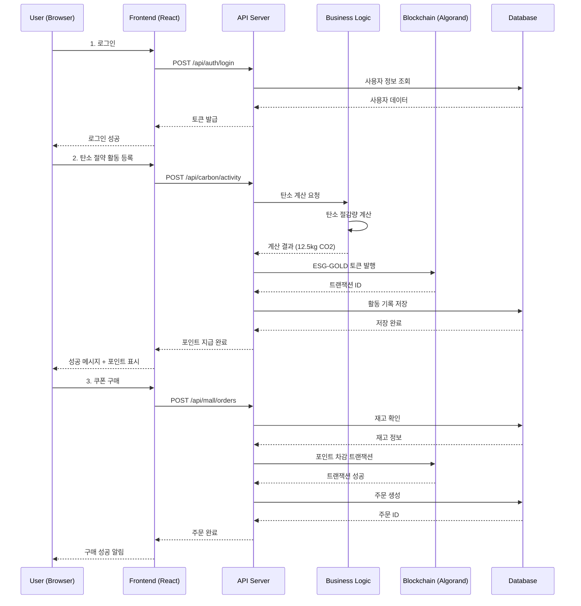

## 인증 및 권한 체계

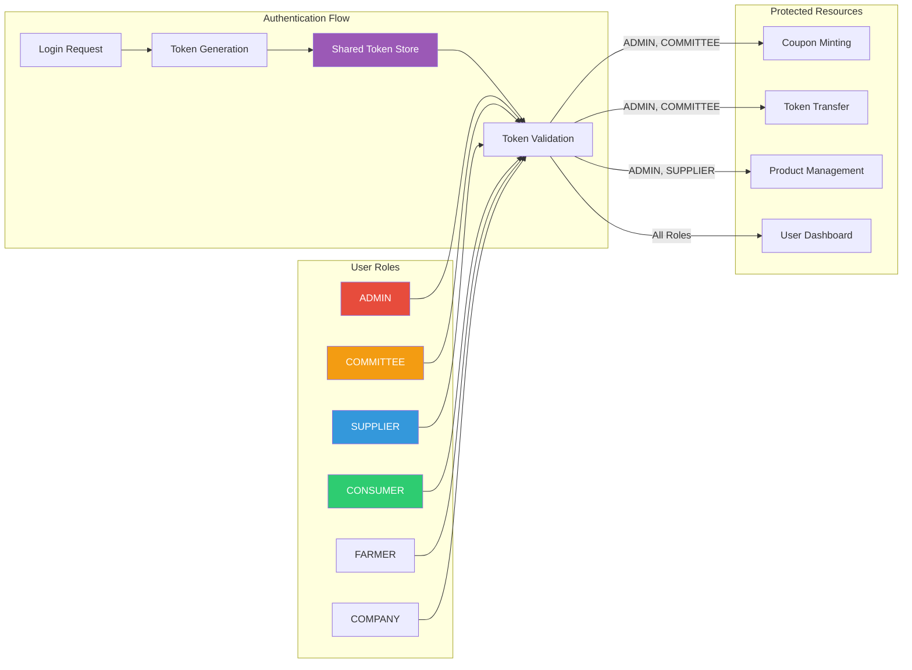

## 블록체인 통합 아키텍처

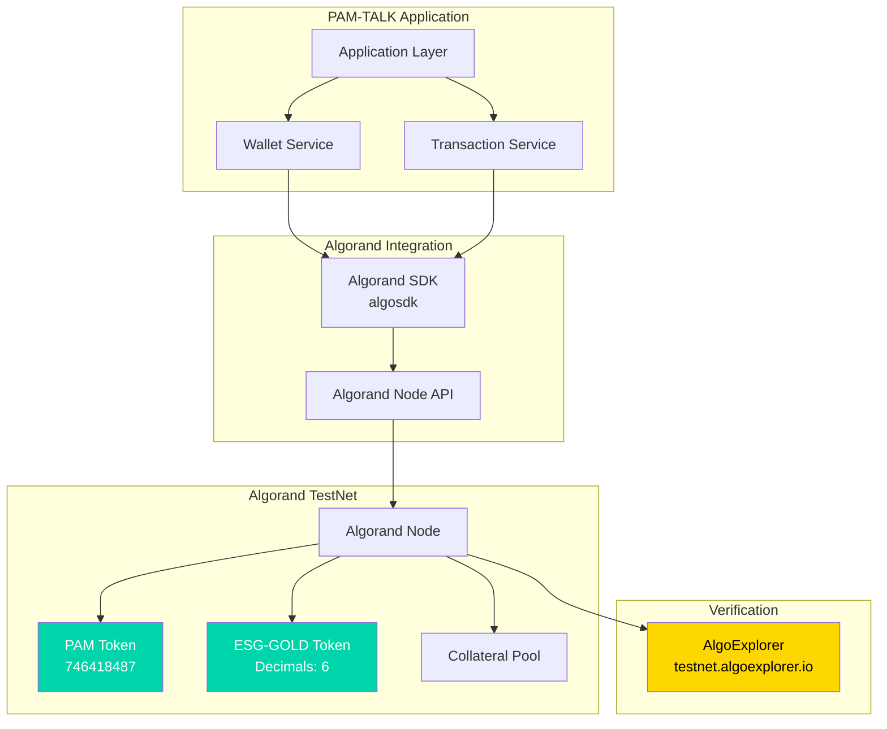

## 탄소 계산 시스템 아키텍처

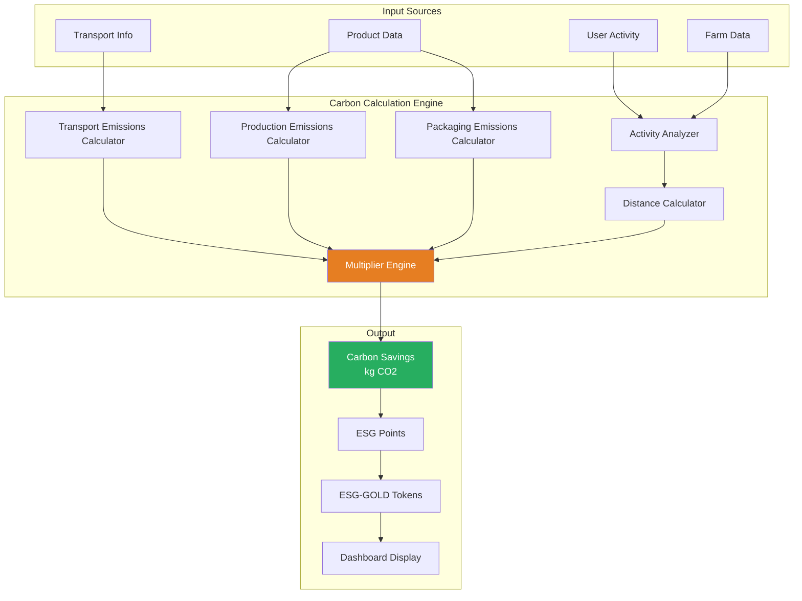

## 배포 아키텍처

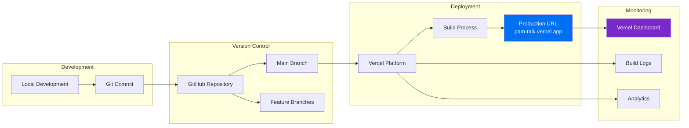

## 실시간 통신 아키텍처

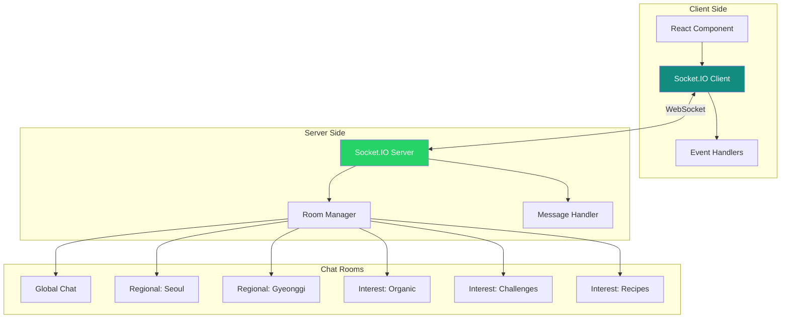

## 데이터베이스 접근 패턴

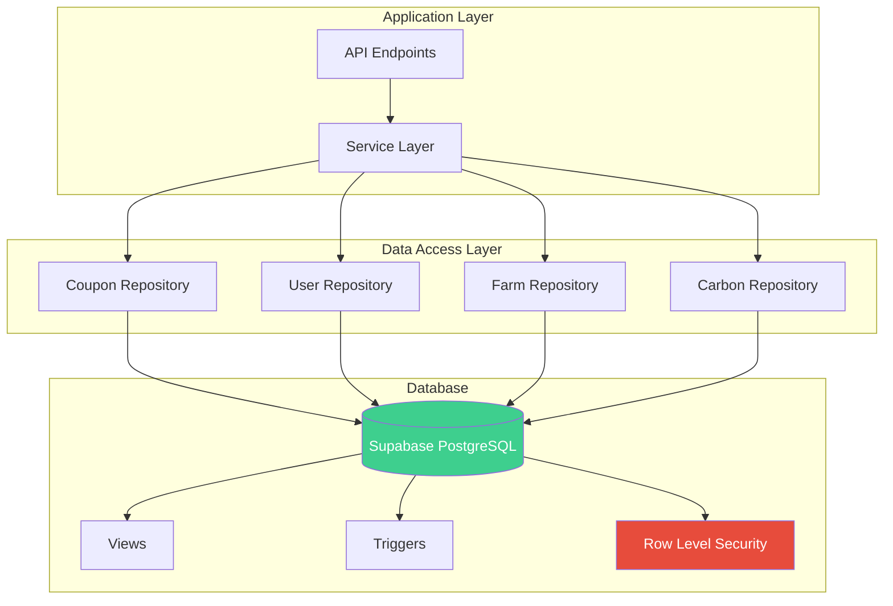

## 보안 계층 구조

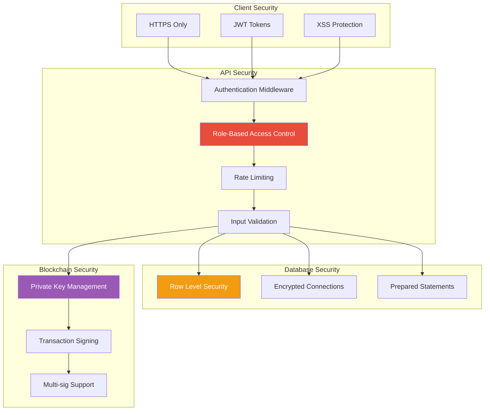

## 기술 스택 전체 맵

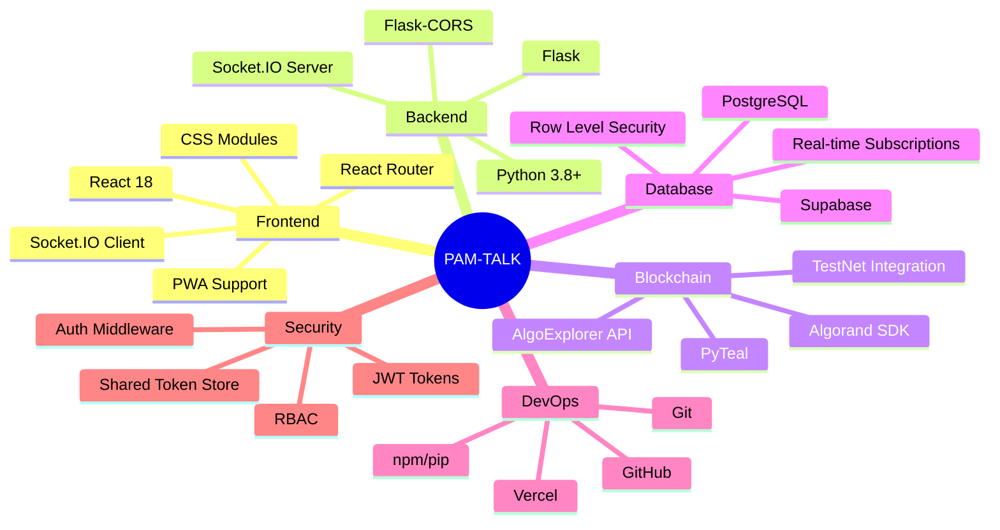

## 주요 컴포넌트 상호작용

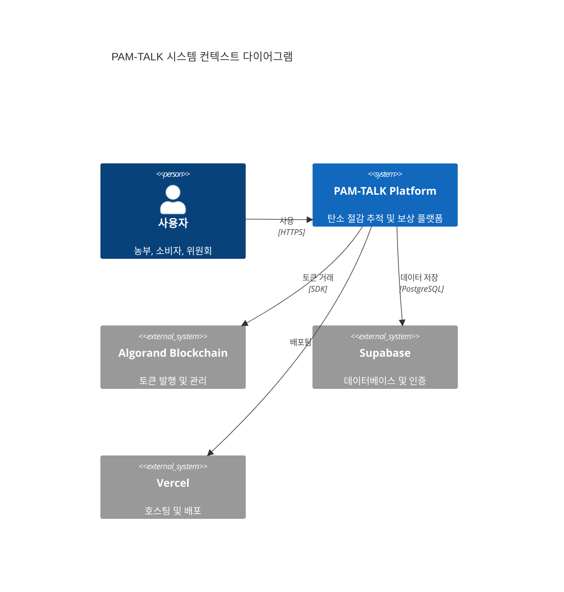

---

## 파일 구조 맵

```
PAM-TALK/
├── frontend/               # React SPA
│   ├── src/
│   │   ├── pages/         # 페이지 컴포넌트
│   │   ├── services/      # API 서비스
│   │   ├── routes/        # 라우팅
│   │   └── styles/        # CSS 파일
│   └── build/             # 프로덕션 빌드
│
├── api/                   # Flask API 서버
│   ├── app.py            # 메인 API (Port 5000)
│   ├── mall_api.py       # 몰 API (Port 5001)
│   ├── auth_middleware.py # 인증 미들웨어
│   └── coupon_manager.py  # 쿠폰 관리
│
├── pamtalk-esg-chain/    # 블록체인 서비스
│   ├── app/
│   │   ├── api/          # 토큰 API
│   │   └── service/      # 비즈니스 로직
│   └── migrations/       # DB 마이그레이션
│
├── supabase/             # 데이터베이스
│   └── schema.sql        # DB 스키마
│
├── static/               # 정적 HTML 페이지
│   ├── index.html
│   ├── community.html
│   └── farms.html
│
└── docs/                 # 문서
    ├── SYSTEM_ARCHITECTURE_DIAGRAM.md (이 파일)
    ├── DATABASE_SCHEMA.md
    └── API_DOCUMENTATION.md
```

---

## 성능 최적화 전략

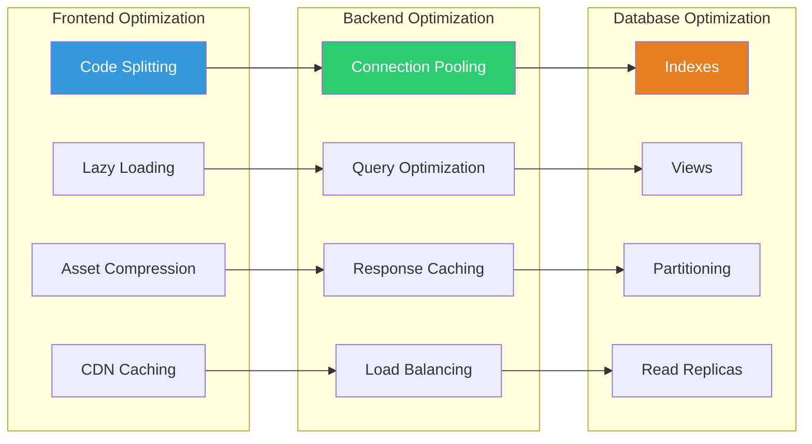

---

## 참고 문서

- [데이터베이스 스키마](./DATABASE_SCHEMA.md)
- [API 문서](../api/API_DOCUMENTATION.md)
- [보안 아키텍처](./SECURITY_ARCHITECTURE.md)
- [Algorand 담보 시스템](../doc/ALGO-Collateral-DC-Minting-System.md)

---

**마지막 업데이트**: 2025-11-28
**다이어그램 형식**: Mermaid (Markdown에서 렌더링 가능)
**뷰어**: GitHub, VS Code (Mermaid 플러그인), Obsidian, Notion
